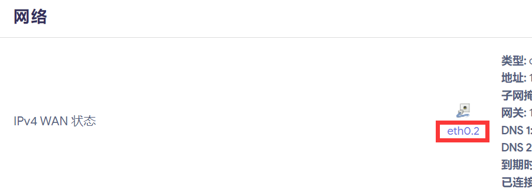
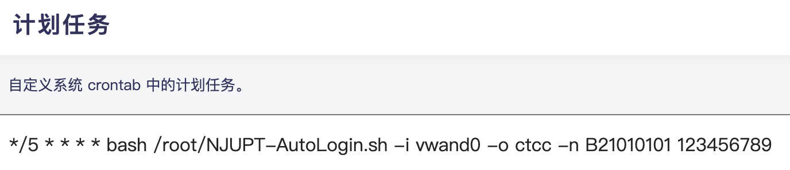

# NJUPT_AutoLogin

南京邮电大学校园网自动登录脚本，支持 macOS、Linux（如 OpenWRT）和 MikroTik RouterOS 平台。** 欢迎提交 Issue 和 PR，一起完善这个脚本。**

适用于 MikroTik RouterOS 平台的使用教程请 [移步这里](./README_RouterOS.md)

## 使用方法

> [!WARNING]
> 脚本会获取系统时间来判断当前时间是否是可上网时间，进而判断是否要尝试登录，所以错误的系统时间可能导致脚本无法正常运行。建议首先校准系统时间。

1. 下载该脚本 `NJUPT-AutoLogin.sh`。
2. 按照下面的选项和参数表构造运行命令。

   一般格式：`bash NJUPT-AutoLogin.sh [-i interface] [-I isp] [-t timeout] [-p ipv4_addr] [-6] [-m] [-n] [-c] [-h] [-v] login_id login_password`
3. 在终端内运行命令。

   例如 `bash NJUPT-AutoLogin.sh -i en0 -I ctcc B21012250 12345678`

如果是在 OpenWRT 路由器平台上运行，可以参考 [在 OpenWRT 上运行](#在-openwrt-上运行)

Linux 使用此脚本前需要检查以下依赖是否安装：
   
| 包名                   | 备注                                                                     |
| ---------------------- | ------------------------------------------------------------------------ |
| **bash**               | 运行脚本的 shell 环境，**必须安装**                                      |
| **curl**               | 实现登录请求相关功能，**必须安装**                                       |
| **net-tools**          | 实现 IP 获取相关功能，**必须安装**                                       |
| iconv                  | 实现返回值转编码相关功能，缺失可能导致 IPv6 连接检测部分报错，不影响使用 |
| network-manager        | 实现 WiFi 自动连接和检测相关功能（nmcli），缺失不影响使用                 |
   
常见的 Linux 发行版一般已预装以上的包，但对于部分轻量化发行版（如 OpenWRT），某些包可能需要手动安装，或无原生支持（特指 OpenWRT 上无原生 network-manager 支持）。

使用前，可能需要在文本编辑器中重设换行符并保存才能正常使用。需要进行此项操作的一个标志是：Linux 下使用文本编辑器打开脚本时，每行行末出现字符 `^M`。

选项表：

| 选项 | 名称                       | 默认值       | 备注                                                                                        |
| ---- | -------------------------- | ------------ | ------------------------------------------------------------------------------------------- |
| `-i` | interface 网络接口         | `en0`        | 指定需要登录的接口，用于获取 IP 地址                                                        |
| `-I` | ISP 运营商                 | `ctcc`       | 指定运营商，教育网为 njupt，电信为 ctcc，移动为 cmcc                                        |
| `-t` | timeout 超时时间           | `2`          | 指定检查网络连通性和发送请求时的超时时间                                                    |
| `-p` | ipv4_addr IPv4 地址        | （自动检测） | 手动指定 IPv4 地址，默认情况下会自动检测本机 IP                                             |
| `-6` | loginv6 教育网 IPv6 登录   | -            | 用于通过教育网 IPv6 地址恢复公网 IPv6 访问权限（[实验性功能](#ipv6-支持实验性)， 默认关闭） |
| `-m` | logout_mode 登出模式       | -            | 切换到登出模式，脚本运行会登出校园网                                                        |
| `-n` | not_limited 无限制账号     | -            | 切换到无时间限制账号，所有时间都会尝试登录                                                  |
| `-c` | conn_skip 跳过连通性检测   | -            | 在执行登录请求前不检查当前网络状态（非多播场景下不要添加该选项）                            |
| `-h` | 显示帮助菜单               | -            |                                                                                             |
| `-v` | 调试输出模式               | -            | 逐条输出脚本代码执行情况                                                                    |

参数表：

| 参数             | 名称       |
| ---------------- | ---------  |
| `login_id`       | 登录用户名 |
| `login_password` | 登录密码   |

已弃用选项表：

| 参数 | 名称                     | 默认值 | 备注                                         |
| ---- | ------------------------ | ------ | -------------------------------------------- |
| -s   | 标记当前位置为三牌楼校区 | -      | ~~三牌楼校区须加上，仙林校区不用~~（已失效） |

> [!TIP]
> 思路及更详细的教程请移步 [Nuotian 的博客](https://nuotian.furry.pro/blog/archives/204#header-id-4)。

> [!CAUTION]
> **2025 年 4 月更新：对已登录的账号发送登录请求会导致账号下线，请不要在非多播场景下添加 `-c` 参数。**  
> **2024 年 9 月更新：目前无法确定校园网 IPv6 的登录接口在不同网络环境下是否通用（在获取到 `2001:da8` 段地址的情况下）。若不能正常使用请提交 Issue。**  
> **2023 年 7 月更新：目前还不知道三牌楼校区的新接口有什么变化，如果不能正常登录请提交 Issue。**

## 更新日志

- 2024.09.20 实验性添加对校园网 IPv6 权限的获取和 WLAN SSID 的识别 [@SteveXu9102](https://github.com/SteveXu9102)
- 2024.04.17 重构；添加对 macOS 的支持 [@BlockLune](https://github.com/BlockLune)
- 2023.07.23 适配 2023 年 7 月更新的校园网接口
- 2022.09.02 添加对多网卡设备的支持
- 2022.08.31 适配三牌楼校区
- 2022.08.31 添加对不断网账号的支持

更多请见 [Releases](https://github.com/s235784/NJUPT_AutoLogin/releases)。

## 在 OpenWRT 上运行

下载 [Releases](https://github.com/s235784/NJUPT_AutoLogin/releases) 中的脚本，上传到路由器中。

进入路由器后台，记住首页出现的 **IPv4 WAN 状态** 中的 **`eth0.x`**，例如我这里是 `eth0.2`。



在路由器的计划任务中添加以下命令，并根据实际情况修改这条命令：

```crontab
*/5 * * * * bash /path/to/your/NJUPT-AutoLogin.sh [-i interface] [-I isp] [-t timeout] [-p ipv4_addr] [-m] [-n] [-h] login_id login_password
```

完整的命令如图（复杂的密码请用 `"` 括起来）



确认无误后保存。之后路由器就会每 5 分钟确认一次网络状态，如果允许登录时间内没有登录校园网，路由器就会自动尝试登录了。

## 进阶用法

- [南邮校园网单线多拨](https://nuotian.furry.pro/blog/archives/347)（部分宿舍有效，需要更多反馈 [#11](https://github.com/s235784/NJUPT_AutoLogin/issues/11)）

## IPv6 支持（实验性）

在原有命令的基础上添加 `-6` 参数，脚本会尝试恢复公网 IPv6 访问权限。</br>
只有在 IPv6 地址段为 `2001:da8:1032::/48`（CERNET 南邮地址段）时才有效。</br>
通过向内网地址 http://192.168.168.168/0.htm 发送 POST 请求来登录，本质上相当于再登录一遍校园网。</br>
使用前应当注意，<u> **此方法可能产生额外费用。** </u></br>
详见参考处百度贴吧链接。</br>
登录后，http://192.168.168.168/1.htm 可以用来查询连接时间、流量、余额等信息。</br>
向 http://192.168.168.168/F.htm 发送 GET 请求后，退出登录。</br>
若在 OpenWRT 使用此功能，由于分配到的 IPv6 地址掩码位数一般是 /128 ，</br>
路由器必须使用 NAT6 方式给下游设备分配 IPv6 地址并将所有网络请求伪装成只由路由器发出。</br>
通常需要留意以下设置：
- 防火墙 LAN / WAN 区域全部 `开启 IPv6 伪装`；
- 接口 - 全局网络选项中的 `IPv6 ULA 前缀` 应当存在且为唯一本地地址 `fd00::/8` 段；
- WAN 侧接口 `禁用` 所有 IPv6 相关服务；
- LAN 侧接口开启 **DHCPv6 服务** 和 **RA 服务** 为 `服务器模式`，`禁用` **NDP 代理**；
- LAN 侧 IPv6 RA 设置中 `强制` **通告路由器为默认服务器 **，**RA 标记** 至少需要开启 `受管配置（M）`；
- 若以路由器为 IPv6 DNS 服务器，则需在 LAN 侧 `通告路由器为 IPv6 DNS 服务器` 且开启 **RA 标记** 的 `其他配置（O）`，并在 Dnsmasq （或其他 DNS 服务，如 AdGuard Home）中设置一些*可靠的*上游 IPv6 DNS 服务器；
- 对于部分移动设备（如小米），若有分配 IPv6 地址的请求，需要在路由器 LAN 侧 IPv6 RA 设置中 `启用 SLAAC`，即无状态地址自动配置（Stateless Address Automatic Configuration）；
- RA 标记中的 `移动home代理（H）` 标记一般用于解决大型无线网络中移动设备漫游时的地址分配问题，无需开启。

## 参考

- [南京邮电大学*校园网/电信宽带/移动宽带*路由器共享 WiFi + 自动认证](https://github.com/kaijianyi/NJUPT_NET)
- [校园网自动登录全平台解决方案](https://zhuanlan.zhihu.com/p/364016452)
- [你邮专的ipv6真的是用不了一点【南京邮电大学吧】_百度贴吧](https://tieba.baidu.com/p/8707266189?pid=150503656049&cid=150604976178#150604976178)

## License

```license
 Copyright 2021, NuoTian

   Licensed under the Apache License, Version 2.0 (the "License");
   you may not use this file except in compliance with the License.
   You may obtain a copy of the License at

       http://www.apache.org/licenses/LICENSE-2.0

   Unless required by applicable law or agreed to in writing, software
   distributed under the License is distributed on an "AS IS" BASIS,
   WITHOUT WARRANTIES OR CONDITIONS OF ANY KIND, either express or implied.
   See the License for the specific language governing permissions and
   limitations under the License.
```
